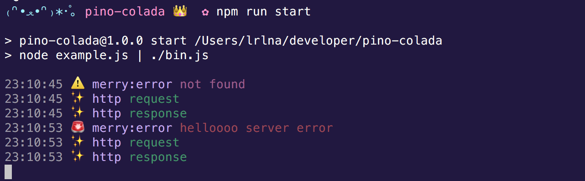

# pino-colada 🍹
[![npm version][1]][2] [![build status][3]][4]
[![downloads][5]][6] [![js-standard-style][7]][8]

A cute [ndjson](http://ndjson.org) formatter for [pino](https://github.com/pinojs/pino). 

 GET 200 / 11B 9ms
15:31:49 🚨 helloooo server error 
Error: helloooo server error
    at createError (/Users/lrlna/Code/pino-colada/node_modules/merry/error.js:15:15)
    at /Users/lrlna/Code/pino-colada/example.js:23:10
    at proxy (/Users/lrlna/Code/pino-colada/node_modules/wayfarer/index.js:42:17)
    at Function.<anonymous> (/Users/lrlna/Code/pino-colada/node_modules/merry/index.js:81:7)
    at emit (/Users/lrlna/Code/pino-colada/node_modules/wayfarer/index.js:57:23)
    at match (/Users/lrlna/Code/pino-colada/node_modules/server-router/index.js:94:12)
    at Server._router (/Users/lrlna/Code/pino-colada/node_modules/merry/index.js:61:14)
    at Server.emit (node:events:390:28)
    at parserOnIncoming (node:_http_server:951:12)
    at HTTPParser.parserOnHeadersComplete (node:_http_common:128:17)
15:31:49 ✨ http <-- GET xxx /error
15:31:49 ✨ http --> GET 500 /error 0B 0ms
15:32:02 ⚠️  not found
15:32:02 ✨ http <-- GET xxx /user
15:32:02 ✨ http --> GET 404 /user 0B 0ms
15:32:07 ⚠️  not found
15:32:07 ✨ http <-- GET xxx /content
15:32:07 ✨ http --> GET 404 /content 0B 1ms
15:33:50 ✨ http <-- POST xxx /user
15:33:50 ✨ http --> POST 200 /user 12B 1ms" />

# Usage
Pipe a server that uses pino into pino-colada for logging.

```bash
node server.js | pino-colada
```

## pino-colada
After parsing input from `server.js`, pino-colada returns a stream and pipes it
over to `process.stdout`. It will output a timestamp, a log level in a form of
an emoji, and a message.

### Usage as [pino prettifier](http://getpino.io/#/docs/pretty?id=api-example)

```javascript
const pino = require('pino')
const logger = pino({
  prettyPrint: {},
  prettifier: require('pino-colada')
})

logger.info('hi')
```

## Log Output Format

pino-colada has a few special-case formatting modes that are enabled by passing
certain keys into pino when the data is logged. Errors, for instance, should
print out the error message and the stack trace. But not all errors will contain
the appropriate keys (such as an error return from a promise).

Below is an example log message to demonstrate how pino-colada processes the
data: 

```bash
10:01:31 🚨 MyNamespace MyFunction Encountered an internal server error GET 500 /test 230B 45ms
Error: Mock Error message triggered.
    at testHandler (/home/user/index.js:175:20)
    at /home/user/index.js:398:11
    at processTicksAndRejections (node:internal/process/task_queues:96:5)
{
  "err": {
    "msg": "Mock Error message triggered."
  }
}
```

Given the following pino log,
```bash
{"level":30,"time":1639403408545,"pid":37661,"hostname":"Irinas-MacBook-Pro.local","name":"http","message":"response","method":"GET","url":"/error","statusCode":500,"elapsed":3,"contentLength":0,"v":1}
```

`pino-colada` produces the following output:
```
14:46:04 ✨ http --> GET 500 /error 0B 3ms
```

The output corresponds to pino's ndjson. Here are is an annotated explanation of how `pino-colada` formats the logs:
```
14:46:04 ✨ http --> GET 500 /error 0B 3ms
         ┬  ─┬─  ─┬─ ─┬─ ─┬─ ───┬── ┬  ─┬─
         |   |    |   |   |     |   |   |
────┬─── |   |    |   |   |     |   |   |
    ╰── "time"    |   |   |     |   |   |
         |   |    |   |   |     |   |   |
         ╰── "level"  |   |     |   |   | 
             |    |   |   |     |   |   |
             ╰── "name"   |     |   |   |
                  |   |   |     |   |   |
                  ╰── "message" |   |   |
                      |   |     |   |   |
                      ╰── "method"  |   |
                          |     |   |   |
                          ╰── "statusCode"
                                |   |   |
                                ╰── "url"
                                    |   |
                                    ╰── "contentLength"
                                        ╰── "elapsed"/"responseTime"
```

A few notes on the formatting:
- We use these emojis to represent the `"level"`:
  * level 10, trace: '🔍'
  * level 20, debug: '🐛',
  * level 30, info: '✨',
  * level 40, warn: '⚠️',
  * level 50, error: '🚨',
  * level 60, fatal: '💀'.
- If the `"message"` value is `request` or `response`, we convert it to `<--` and `-->` respectively.
- If `"stack"` property is present, `pino-colada` will print the stack trace following the formatted error log.

# Install
```bash
npm install pino-colada
```

# Related content
- [pino](https://github.com/pinojs/pino)
- [merry](https://github.com/shipharbor/merry)
- [garnish](https://github.com/mattdesl/garnish)
- [@studio/log](https://github.com/javascript-studio/studio-log)
- [pino-http](https://github.com/pinojs/pino-http)
- [hapi-pino](https://github.com/pinojs/hapi-pino)

## License
[MIT](https://tldrlegal.com/license/mit-license)

[1]: https://img.shields.io/npm/v/pino-colada.svg?style=flat-square
[2]: https://npmjs.org/package/pino-colada
[3]: https://img.shields.io/travis/lrlna/pino-colada/master.svg?style=flat-square
[4]: https://travis-ci.org/lrlna/pino-colada
[5]: http://img.shields.io/npm/dm/pino-colada.svg?style=flat-square
[6]: https://npmjs.org/package/pino-colada
[7]: https://img.shields.io/badge/code%20style-standard-brightgreen.svg?style=flat-square
[8]: https://github.com/feross/standard
