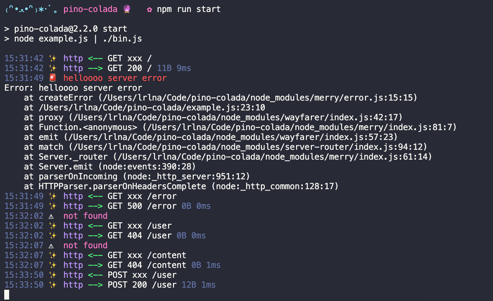

# pino-colada 🍹
[![npm version][1]][2] [![build status][3]][4]
[![downloads][5]][6] [![js-standard-style][7]][8]

A cute [ndjson](http://ndjson.org) formatter for [pino](https://github.com/pinojs/pino). 



# Usage
Pipe a server that uses pino into pino-colada for logging.

```bash
node server.js | pino-colada
```

## pino-colada
After parsing input from `server.js`, pino-colada returns a stream and pipes it
over to `process.stdout`. It will output a timestamp, a log level in a form of
an emoji, and a message.

# Programmatic integration as [pino prettifier](http://getpino.io/#/docs/pretty?id=api-example)

```javascript
const pino = require('pino')
const logger = pino({
  prettyPrint: {},
  prettifier: require('pino-colada')
})

logger.info('hi')
```

# Install
```bash
npm install pino-colada
```

# Log Output Format

pino-colada has a few special-case formatting modes that are enabled by passing
certain keys into pino when the data is logged. Errors, for instance, should
print out the error message and the stack trace. But not all "errors" will
contain the appropriate keys (such as an error return from a promise).

Below is an example log message to demonstrate where pino-colada gets the data
from:

```
10:01:31 🚨 MyNamespace MyFunction Encountered an internal server error GET 500 /test 230B 45ms
Error: Mock Error message triggered.
    at testHandler (/home/user/index.js:175:20)
    at /home/user/index.js:398:11
    at processTicksAndRejections (node:internal/process/task_queues:96:5)
{
  "err": {
    "msg": "Mock Error message triggered."
  }
}
```

So where does it get this data from? Each piece of data comes from the pino log
entry.

1. The first line is the main log message
		1. The date comes from the log's `time` key, or the current time if no
			 `time` key exists
		2. The Emoji (and log message colors) are determined by the log's `level`
			 key
		3. MyNamespace is the namespace given to the log entry via the `ns` key
		4. MyFunction is the name given to the log entry via the `name` key
		5. Between the `name` and the word `GET` is the message from the `message`
			 key. If the message is `request` or `response`, then `<--` or `-->` will
			 be output instead
		6. `GET` is the HTTP Request method from `req.method`
		7. `500` is the HTTP Return Status Code from `res.statusCode`
		8. `/test` is the requested URL from `req.url`
		9. `230B` comes from the HTTP Content length via `contentLength`
		10. `45ms` is the time it took for the code to complete and comes from
				either the `responseTime` or `elapsed` keys in the log
2. The second "line" is the stack trace, printing out the contents of the
	 `stack` variable
3. The final "line" is a `JSON.stringify`, pretty printed dump of whatever the
	 `err` key contains


# Related content
- [pino](https://github.com/pinojs/pino)
- [merry](https://github.com/shipharbor/merry)
- [garnish](https://github.com/mattdesl/garnish)
- [@studio/log](https://github.com/javascript-studio/studio-log)
- [pino-http](https://github.com/pinojs/pino-http)
- [hapi-pino](https://github.com/pinojs/hapi-pino)

## License
[MIT](https://tldrlegal.com/license/mit-license)

[1]: https://img.shields.io/npm/v/pino-colada.svg?style=flat-square
[2]: https://npmjs.org/package/pino-colada
[3]: https://img.shields.io/travis/lrlna/pino-colada/master.svg?style=flat-square
[4]: https://travis-ci.org/lrlna/pino-colada
[5]: http://img.shields.io/npm/dm/pino-colada.svg?style=flat-square
[6]: https://npmjs.org/package/pino-colada
[7]: https://img.shields.io/badge/code%20style-standard-brightgreen.svg?style=flat-square
[8]: https://github.com/feross/standard
